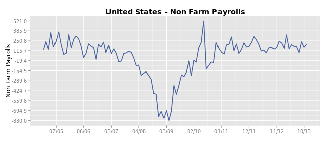
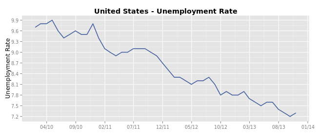
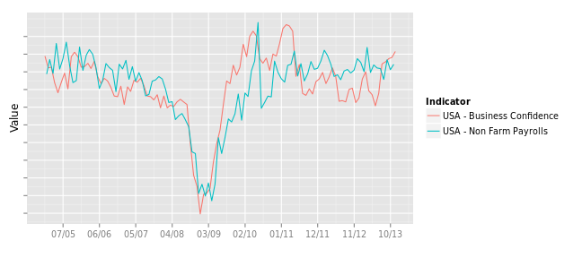
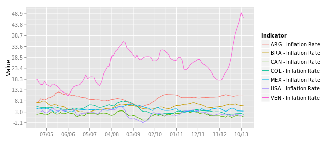
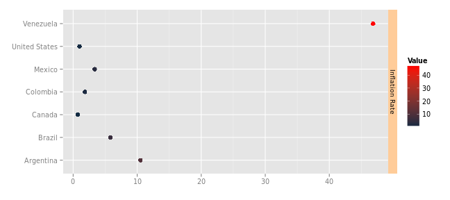
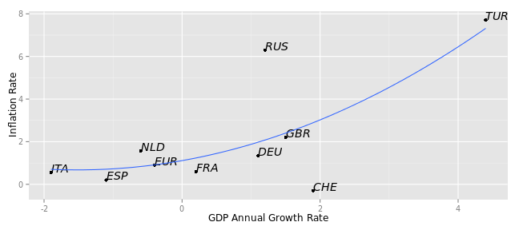

Title +++
========================================================

OK, so first you load TE package and create a "passport" with your credentials to take full advantage of TE's Database.
Load the library:

```r
library(TE)
```

And create the passport using your credentials. You can also take it for a limited ride with guest credentials.

```r
myUsername = "guest"
myPassword = "guest"
pp = set.auth(myUsername, myPassword)
```

So now we are ready to start plotting ! For a simple country-indicator plot you can go:

```r
te.plot(pp, "United States", "Non Farm Payrolls")
```

 

You can define the country and indicator variables beforehand to simplify edits. Also, you can add a Start-Date value to better adjust the chart.

```r
country = "United States"
indicator = "Unemployment Rate"
startDate = "2010-01-01"
te.plot(pp, country, indicator, startDate)
```

 

To see how Business Condifence and Non Farm Payrrols afect each other:

```r
analyze = c("United States:Business Confidence", "United States:Non Farm Payrolls")
te.plot.multi(pp, analyze)
```

 

And what about more interesting cross-analysis?
Let's say you're interested in vizualizing some data for the G20 Group. Grouping the countries is as easy as:

```r
te.countries(pp, "G20")
```

```
##  [1] "United States"  "Euro Area"      "China"          "Japan"         
##  [5] "Germany"        "France"         "United Kingdom" "Brazil"        
##  [9] "Russia"         "Italy"          "India"          "Canada"        
## [13] "Australia"      "Spain"          "Mexico"         "South Korea"   
## [17] "Indonesia"      "Turkey"         "Netherlands"    "Switzerland"
```

You can also pick any other G-'number'! And what about the fastest 10 growing countries? or the worst 5 performers? 

```r
te.countries(pp, "G3")
```

```
## [1] "United States" "Euro Area"     "China"
```

```r
te.countries(pp, "Emerging10")
```

```
##  [1] "Libya"        "Paraguay"     "Afghanistan"  "Mongolia"    
##  [5] "Turkmenistan" "Niger"        "East Timor"   "Macao"       
##  [9] "Iraq"         "Ivory Coast"
```

```r
te.countries(pp, "Plunging5")
```

```
## [1] "South Sudan" "Cyprus"      "Iran"        "Greece"      "Syria"
```


Let's select Top 7 American countries and see the how consumer prices have been behaving:

```r
countries = te.countries(pp, "America7")
indicators = "Inflation Rate"

te.plot.multi(pp, countries, indicators)
```

 

And for a latest-value comparison:

```r
te.plot.compare.scale(pp, countries, indicators)
```

 

All very nice, but how are consumer prices related with GDP Growth in Europe ? 

```r
indicators = c("GDP Annual Growth Rate", "Inflation Rate")
countries = te.countries(pp, "Europe10")
te.plot.compare(pp, countries, indicators)
```

 

